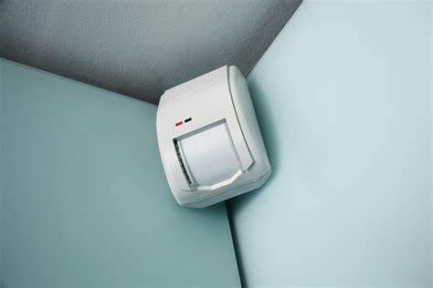
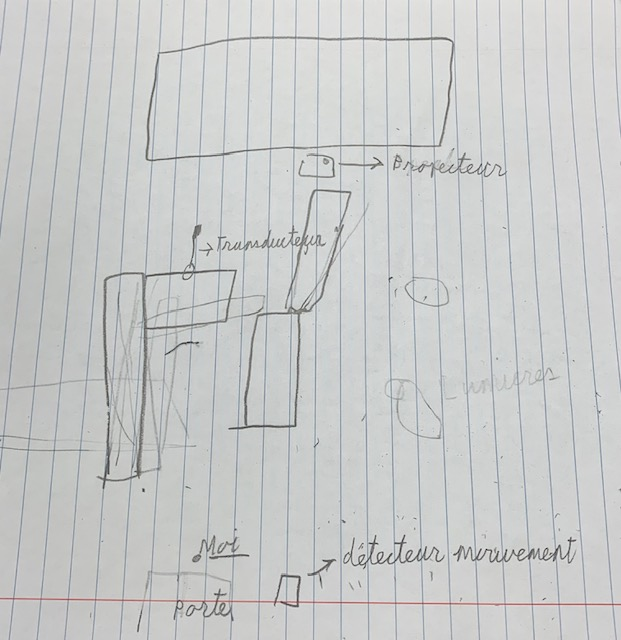

# Le fleuve et l'en deçà.

## Nom de l'artiste
Béchard Hudon

## Année de réalisation
2021

## Nom de l'exposition
Configuration du sensible

## Lieu de l'exposition
Maison des arts de Laval, salle Alfred Pellan

## Date de ma visite
 Le 16 mars 2022
 
## Description de l'oeuvre 
### le fleuve 
Comme le suggèrent les coordonnées géographiques de l'intitulé cette oeuvre s'attache à un lieu en particulier. Il s'agit de la Pointe de Moisie, à proximité de Sept-îles : une niche écologique offrant un panorama exceptionnel sur le territoire fluvial du Saint-Laurent qui, à cette hauteur, se confond avec la mer. C'est là que fût tourné le riche bassin d'images ayant servi à cette composition visuelle qui, par des jeux de déboulements en enfilade, verse dans une abstraction hypnotique. Si le paysage marin que l'on devine fait écho aux sonorités aquatiques de l'en déçà, les flots géométriques, parfois finement striés, dialoguent librement avec les Mécanismes de déssaisissement. (Photo pris : [du cartel lors de l'exposition](photographies/cartel_fleuve.jpg))

## L'en-deçà
C'est sur le vaste territoire compris entre Sept-îles et Kegaska, sur la Côte-Nord, que furent captés les paywages sonores singuliers au coeur de cette oeuvre. L'usage d'hydrogènes, soit des micros pouvant enregistrer sous l'eau, ainsi que des géophones spécialement conçus par les artistes pour capter les vibrations du sol et les traduire en sons, fut essentiel au projet. Diffusée via des transducteurs - qui ici transforment les parois de bois en membranes de transmission sonore -, la composition qui découle de ces enregistrements permet d'entendre une faune marine complexe, notamment une colonie d'oursins, et des sons que ni les artistes ni les pêcheurs, ni d'autres habitants rencontrés dans la région ne furent capables d'identifier avec précision. Cette part de mystère est soutenue par les détecteurs de mouvements qui active la bande-son, avec des moments de silence lorsque les gens se font absents. Le mode d'attention particulier que ces silences convoquent fait partie intégrante de l'oeuvre, il s'agit d'un motif que le duo traite de longue date. (Photo pris : [du cartel lors de l'exposition](photographies/cartel_l'en_deca.jpg))

## Mise en espace de l'expoition. 
 Il y a 4 planches de bois debout mis à la verticale positionné de différents angles. Puis à l"extérieur de la plateforme il y a des transducteurs résonner le son sur les planches de bois. Alors lorsqu'on met nos mains ou nos oreilles sur la plateforme de bois on peut ressentir de la vibration. Puis autour de la pièce il y a des hauts-parleurs car l'oeuvre l'en deçà est une oeuvre essentiellement auditive, puis les haut-parleurs s'activent au moment ou ils détectent des gens rentrer. Ensuite pour le fleuvre il y a un projecteur qui projète la vidéo à l'écran.

(photo pris : [haut-parleur](https://www.bing.com/images/search?view=detailV2&ccid=AeB35eIM&id=1A717D70295F699CA2176538AA69500410DB9E37&thid=OIP.AeB35eIMn2ZFG3sxKG4JggHaFT&mediaurl=https%3a%2f%2fwww.pmclab.fr%2fwp-content%2fuploads%2fTop-10-Des-Meilleurs-Haut-parleurs-De-Moniteur-De-Studio-USB-1024x733.jpg&cdnurl=https%3a%2f%2fth.bing.com%2fth%2fid%2fR.01e077e5e20c9f66451b7b31286e0982%3frik%3dN57bEARQaao4ZQ%26pid%3dImgRaw%26r%3d0&exph=733&expw=1024&q=haut+parleur+d%27une+t%c3%a9l%c3%a9vision+photo&simid=607999079721220629&FORM=IRPRST&ck=10BF982EC67A1B8888C2B858212BD171&selectedIndex=0&ajaxhist=0&ajaxserp=0))

photo de transducteur

photo de l'ensemble de l'oeuvre l'en deçà

(photo pris : [détecteur de mouvement](https://www.bing.com/images/search?view=detailV2&ccid=aBpkTaAh&id=75BC1AAEF17FF98CB9CAAD56332E368F5A94D462&thid=OIP.aBpkTaAhi5klmHcUeNr_IQHaE8&mediaurl=https%3a%2f%2fwww.securitasdirect.fr%2fsites%2fdefault%2ffiles%2fdetecteurs-mouvement-image-fonctionnement.jpg&cdnurl=https%3a%2f%2fth.bing.com%2fth%2fid%2fR.681a644da0218b992598771478daff21%3frik%3dYtSUWo82LjNWrQ%26pid%3dImgRaw%26r%3d0&exph=427&expw=640&q=d%c3%a9tecteur+de+mouvement+photographique&simid=608008666091043046&FORM=IRPRST&ck=9A4AE1E52BB430776B83D8CE3D742A44&selectedIndex=0&idpp=overlayview&ajaxhist=0&ajaxserp=0))

photo du projecteur

photo de l'ensemble de l'oeuvre du fleuve

## Liste des éléments
Une tablette pour contrôler le son et l'intensité de la vibration transmis aux transducteurs, des prises de connection, des extensions etc

Des lumières accrocher au plafond 

## Ce que j'ai aimé
Ce que j'ai aimé c'est qu'ils ont fait une oeuvre qui se concentre plus sur les autres sens qu'une simple oeuvre visuelle. Je trouve ça très originale car c'est rare qu'une oeuvre se concentre essentiellement sur l'audition et le touché. 

## Ce que j'ai moins aimé 
J'enlèverais l'écran qui représente le fleuve. En fait c'est complémentaire et ce n'est pas quelque chose de nécessairement inutile mais je crois pas que c'est nécessaire. Une simple affiche qui explique le lieu pourrait être suffisant

Croquis

