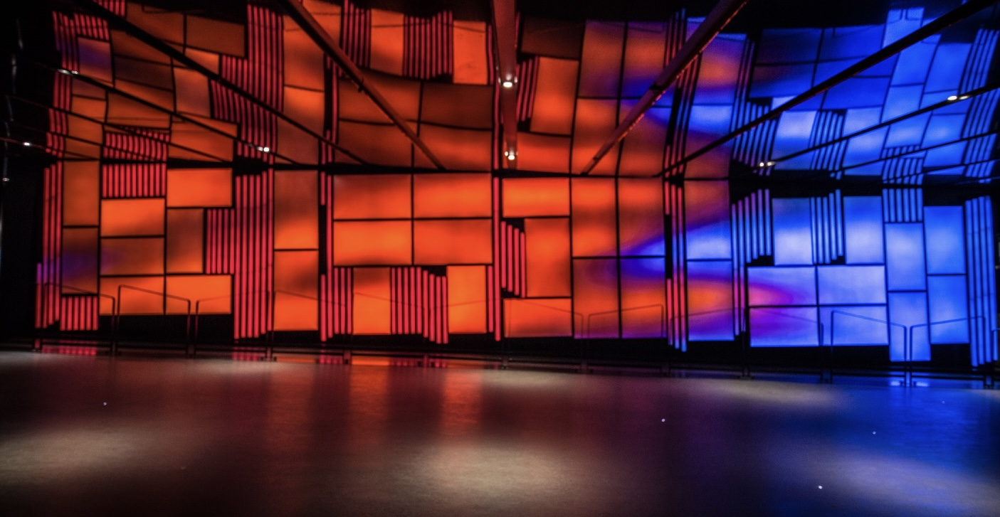
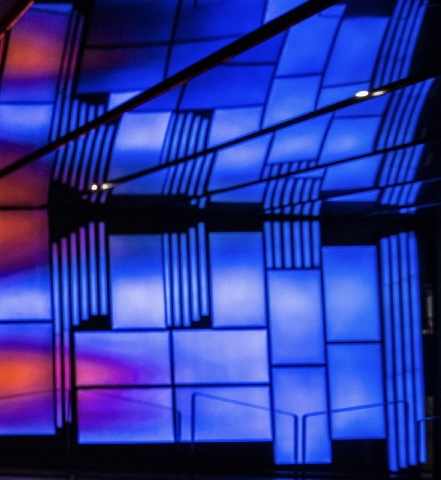

# Couloirs de la Place des Arts 

## Artistes
Steve Heimbecker et Frédéric Lavoie

## Année de réalisation 
2016

## Nom de l'exposition
Paravent Mosaïque 

## Lieu de mise en exposition
Place des Arts

## Date de votre visite 
1e 30 avril 2022

## Description de l'oeuvre
Paravent Mosaïque de Steve Heimbecker est une installation vidéo à haute résolution avec son quadriphonique qui illustre la configuration des vents à partir de captations prises sur le toît d'un édifice montréalais qu'il a réalisée avec la collaboration technique de l'artiste audio Patrice Coulombe et de la vidéographe Line Dezainde. Texte pris du : [site du gouvernement du Québec](https://www.calq.gouv.qc.ca/actualites-et-publications/actualites/le-public-peut-voir-deux-oeuvres-numeriques-soutenues-par-la-place-des-arts-et-le-conseil-des-arts-et-des-lettres-du-quebec)) 

## Mise en exposition
Les oeuvres au Couloirs de la Place des Arts dont Paravent Mosaïque contient une mosaïque de 35 écrans numériques qui permet la diffusion d'oeuvres et d'animations numériques. Aussi il y a des hauts- parleurs pour diriger le son un peu partout dans la pièce. Ensuite grâce à un ordinateur connectés par des fils cela permet de diffuser les images sur l'écran. Ça serait comme des écrans de télévision.

### Photo de l'ensemble de l'oeuvre

(photo pris : [d'un site web photo haut-parleur](https://www.crazypng.com/download.php?url=http://pngimg.com/download/11164))

## Liste des éléments
Les images des écrans sont reflétées sur les miroirs installés au plafond 
Cela 

