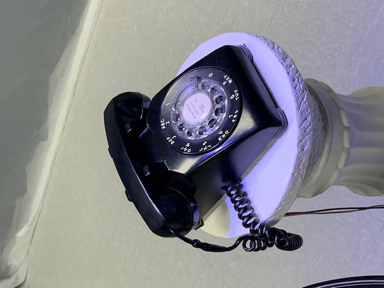

L'horloge de l'apocalypse

## Nom des artistes/créateurs
Maxime Sabourin, Louis-Phillipe Gravel, Louis Lacasse et Tristan Girard-Montpetit.

## Année de réalisation
Cette oeuvre multimédia s'est réalisé en 2022.

## Nom de l'exposition
Le nom de l'exposition est intitulé Moebius.

## La date de ma visite à l'exposition.
Le 23 mars 2022

## Description de l'horloge apocalypse
L’horloge de l’apocalypse représente la ligne du temps de l’humanité. Selon le concept de l’horloge, il est présentement 11 h 58 et il reste 2 minutes avant la fin de l’humanité. À travers ce projet, l’interacteur est invité à contrôler l’horloge grâce aux aiguilles et ainsi manipuler la ligne du temps. Au cours de l’expérience, vous pourrez vivre les différentes époques auxquelles la terre a été exposée. Vous serez exposé aux différents enjeux actuels à travers la projection qui vous entourera et par le fait même vous plongera dans une immersion totale.
(Source : [Résumé du projet](https://tim-montmorency.com/2022/projets/L-horloge-de-l-apocalypse/docs/web/index.html))

## Mise en exposition de l'horloge de l'apocalypse
Cette oeuvre se situe dans une pièce où il y a 3 projecteurs pour le projeter sur le mur et 4 haut-paleur à chaque coin de la pièce. Puis il y a une horloge au millieu de la pièce et grâce a un détecteur de mouvement cela permet  qu'à chaque fois que tu tournes l'aiguille une nouvelle image et donc une nouvelle époque va commencer. Après avoir tourner l'aiguille tout le tour de l'horloge, le téléphone va sonner pour annoncer la fin du monde et donc la fin de l'exposition.

## Photographie de la mise en espace
### Photo de l'oeuvre dans son ensemble

### Autoportrait

## Liste des composantes
Il y a 4 hauts-parleurs 

Il y a 3 projecteurs (un pour chaque mur qui ont été projeté 

L'horloge et détecteur de mouvement 

le téléphone 

## Liste des éléments
### Meuble blanc pour mettre le téléphone

### Trépied pour soutenir l'horloge

Pas tres visible mais on voit les pattes du trépied qui soutient l'horloge

## Ce que j'ai aimé 
J'ai aimé la créativité et la précision de cette oeuvre. J'ai trouvé que tout allait bien ensemble et tout au long de l'expérience j'était toujours curieux et intérésser de voir à quoi ressemble la prochaine image. Aussi j'ai aimé le fait qu'il aille mit des haut-parleur à chque coin de la pièce car ca donnait l'impression que nous étions vraiment entrain de vivre l'éxpérience pour de vrai.

## Ce que j'ai moins aimé
La seule chose que j'ai moins aimé dans le projet et cela est un mini détail c'est le fait que lorsque le téléphone sonne et on répond ça nous prend un moment avant de comprendre qu'il faut raccrocher pour terminer l'expérimentation. Je pense il y aurait un moyen de l'améliorer en enregistrant une voix pour nous dire quoi faire et nous guider.

## Croquis
