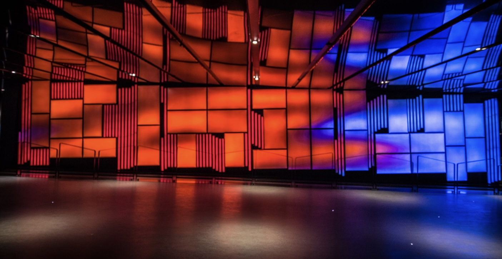
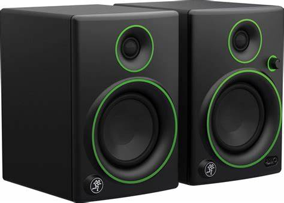
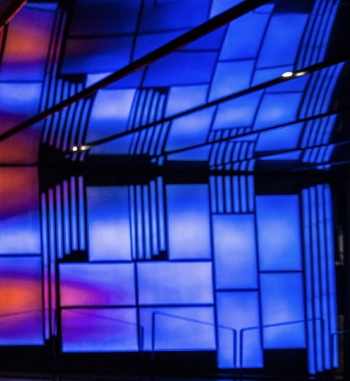

# Introduction

## Sujet Posé
Dans le cadre du cours <<Documentation d'une collection multimédia>> on est rendu au point où il faut présenter une oeuvre qu'on est allé voir seule et la présenter au reste de la classe. Maintenant que c'est a mon tour de présenter je vais vous parler et vous en faire apprendre sur l'exposition que j'ai choisi

## Présentation de mon oeuvre
Situé entre le métro Place des Arts et le complexe Desjardins à Montréal, en plein millieu du quartier des spectacles : Il y a une zone multimédia qui est installée dans son couloir principal. Une mosaïquye de 35 écrans numériques offre une plateforme originale de diffusion.
!(Texte pris du [gouvernement du Québec](https://www.calq.gouv.qc.ca/actualites-et-publications/actualites/le-public-peut-voir-deux-oeuvres-numeriques-soutenues-par-la-place-des-arts-et-le-conseil-des-arts-et-des-lettres-du-quebec)). Ça permet aussi à la Place des Arts de mettre en vitrine autant des créateurs numériques emergents que des artistes déjà établies. Cela permet de donner de bonnes opportunité à des artistes moins connus. !(Texte pris du [gouvernement du Québec](https://www.calq.gouv.qc.ca/actualites-et-publications/actualites/nouvelles-oeuvres-numeriques-place-des-arts-2019))

## Sujet divisé 
Mes les points importants sont 
Titre de l'oeuvre 
Les artistes et les collaborateurs
Année de réalisation
Nom de l'exposition
Lieu de la mise en exposition
Date de ma visite
Description de l'oeuvre
Mise en exposition 
Liste des éléments
Ce que j'ai aimé
Ce que j'ai moins aimé 
Une vidéo pour vous montrer ça l'air de quoi

# Développement

## Titre de l'oeuvre 
Paravent Mosaïque 

## Artistes
Steve Heimbecker  
### Collaborateur
Patrice Coulombe et Lize Dezainde

## Année de réalisation 
2016

## Nom de l'exposition
 Le couloir de la Place des Arts

## Lieu de mise en exposition
Place des Arts

## Date de votre visite 
1e 17 avril

## Description de l'oeuvre
Paravent Mosaïque de Steve Heimbecker est une installation vidéo à haute résolution avec son quadriphonique qui illustre la configuration des vents à partir de captations prises sur le toît d'un édifice montréalais qu'il a réalisée avec la collaboration technique de l'artiste audio Patrice Coulombe et de la vidéographe Line Dezainde. Texte pris du : [site du gouvernement du Québec](https://www.calq.gouv.qc.ca/actualites-et-publications/actualites/le-public-peut-voir-deux-oeuvres-numeriques-soutenues-par-la-place-des-arts-et-le-conseil-des-arts-et-des-lettres-du-quebec)) 

## Mise en exposition
Les oeuvres au Couloirs de la Place des Arts dont Paravent Mosaïque contient une mosaïque de 35 écrans numériques qui permet la diffusion d'oeuvres et d'animations numériques. Aussi il y a des hauts- parleurs pour diriger le son un peu partout dans la pièce. Ensuite les images ne sont pas projeté mais sont diffusés un peu comme si c'était des télévisions. Donc la base de données vient probablement d'un ordinateur pour programmer et préparer la diffusion des images sur les écrans. 

## Liste des éléments
Les images des écrans sont reflétées sur les miroirs installés au plafond cela donne un effet globale comme si tu faisait partie de l'oeuvre

Des fils connecte l'ordinateur et les écrans pour transmettre l'information et permettre la diffusion des images sur les écrans.

### Photo mise en exposition et des éléments

(photo pris : [d'un site web photo paravent mosaïque](https://heimbecker.files.wordpress.com/2017/02/paravent-mosaique-1-72.jpg))

(photo pris : [d'un site web photo haut-parleur](https://www.bing.com/images/search?view=detailV2&ccid=AeB35eIM&id=1A717D70295F699CA2176538AA69500410DB9E37&thid=OIP.AeB35eIMn2ZFG3sxKG4JggHaFT&mediaurl=https%3a%2f%2fwww.pmclab.fr%2fwp-content%2fuploads%2fTop-10-Des-Meilleurs-Haut-parleurs-De-Moniteur-De-Studio-USB-1024x733.jpg&cdnurl=https%3a%2f%2fth.bing.com%2fth%2fid%2fR.01e077e5e20c9f66451b7b31286e0982%3frik%3dN57bEARQaao4ZQ%26pid%3dImgRaw%26r%3d0&exph=733&expw=1024&q=haut+parleur+d%27une+t%c3%a9l%c3%a9vision+photo&simid=607999079721220629&FORM=IRPRST&ck=10BF982EC67A1B8888C2B858212BD171&selectedIndex=0&ajaxhist=0&ajaxserp=0))

(photo pris : [d'un site web photo paravent mosaïque](https://heimbecker.files.wordpress.com/2017/02/paravent-mosaique-1-72.jpg))

## Ce que j'ai aimé
J'ai vraiment aimé le fait qu'il comporte des miroirs sur le plafond. Parce que c'est beaucoup plus beau esthétiquement de voir l'oeuvre refléter sur le plafond que si on voyait juste la lumière des écrans avec aucun reflet. Aussi ça donne plus un effet de vivre dans l'oeuvre et un côté immersif que juste regarder un écran et la vidéo qui défile sur les images. En plus ayant une réflexion sur le mur ça attire l'oeil a regardé un peu partout et d'admirer la vue. 

## Ce que j'ai moins aimé. 
j'ai surtout moins aimé le lieu de l'emplacement. C'est très ouvert et beaucoup de monde peut passer par là. Je trouve qu'il serait une meilleure idée de le mettre dans un endroit fermé et assez sombre pour pouvoir possiblement permettre et favoriser le réflètement des images car pour l'instant en raison que c'est ouvert on voit de la lumière qui est un peu inutile à mon avis et le son ne peut pas être aussi fort qu'il le pourrait car des personnes marchent, parlent ce qui dérange l'exposition.

## Lien avec d'autres oeuvres multimédia vus cette session
Le coté immersif des oeuvres

## Vidéo et extrait

# Conclusion

